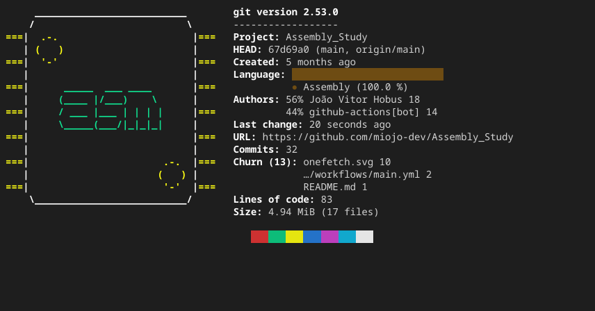

# Assembly study

Small study to learn the assembly basics

<!-- ONEFETCH_START -->

<!-- ONEFETCH_END -->

---

I used the [assembly4noobs](https://github.com/andreluispy/assembly4noobs) tutorial on GitHub

*note: this project was made on linux, so it may not work in other OS

---

## 🧪 Tecnologies used

- Assembly language
- nasm compiler
- 
